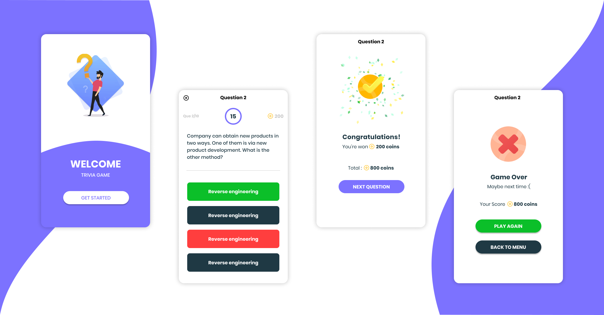

    

# 60 Seconds Quiz Challenge

### How many questions can you solve in 60 seconds? Lets start!

## Content

The repository contains:

- a [React Native](https://facebook.github.io/react-native/) (v**0.62.2**)
- a [React Navigation](https://reactnavigation.org/en/) (v**5**)
- a [Styled System](https://styled-system.com/)
- a [Styled Components](https://styled-components.com/)
- a [React Native Lottie](https://github.com/react-native-community/lottie-react-native)
- a [React Hooks](https://reactjs.org/docs/hooks-intro.html)
- a [Open Trivia DB](https://opentdb.com/api_config.php)
- [prettier](https://prettier.io/) and [eslint](https://eslint.org/) preconfigured for React Native
- a [clear directory layout](#directory-layout) to provide a base architecture

## Directory layout

- [`src/components`](src/components): presentational components
- [`src/redux`](src/redux): redux files
- [`src/views`](src/views): the application's screens
- [`src/assets`](src/assets): assets (image, audio files, ...) used by the application
- [`src/utils`](src/utils): theme files etc
- [`src/fonts`](src/fonts): fonts files
- [`src/api`](src/api): api service

## License

This project is released under the [MIT License](LICENSE).
